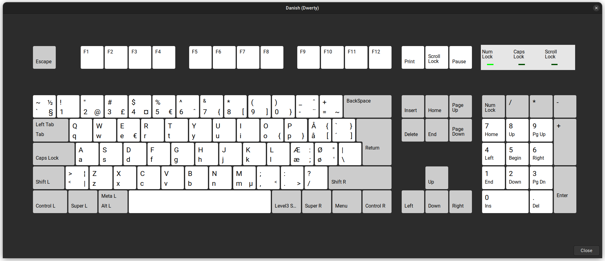

Danish keyboard layout based on ANSI:
===



This layout adds the danish Æ, Ø and Å symbols to the ANSI / US keyboard layout. The ANSI layout is much more convenient for programmers than the normal Danish ISO layout. Symbols frequently uses such as `{} []` are hidden in the danish layout on layer 3 in the numbers 7 - 0. The ANSI layout have them as first class citizens on layer 1 and 2 on dedicated keys. Hoever for Danish these keys are used for the accent symbols and therefore not available. So the compromise in `Dwerty` is to put them on layer 3 and 4 on the same keys, and for convenience also on layer 3 on `o` and `p`. Take a look at the `layout.png` if this makes sense to you. Otherwise it's easy to modify the layout text file.

Credits
--

This is an adaptation of the Swerty keylayout for Danish:
https://johanegustafsson.net/projects/swerty/

Made by Johan de Claville Christiansen - 2022

Installation instructions: Dwerty for Linux
--

Add the contents of se.txt to the end of the file /usr/share/X11/xkb/symbols/dk.
Then look up the following section in the file /usr/share/X11/xkb/rules/evdev.xml:


```
    <layout>
      <configItem>
        <name>dk</name>
        ....
```

Add the following variant block after the line <variantList>:

```
        <variant>
          <configItem>
            <name>dwerty</name>
            <description>Dwerty</description>
          </configItem>
        </variant>
```

Finally, after the line "! variant" in the file /usr/share/X11/xkb/rules/evdev.lst add the following line:
  dwerty          dk: Dwerty

Now Dwerty should show up as one of the alternative keyboard layouts for Danish 

Notes
--
Note that the screenshot `layout.png` shows the layout with a PC105 keyboard, while it is intended for PC104 (ansi)
